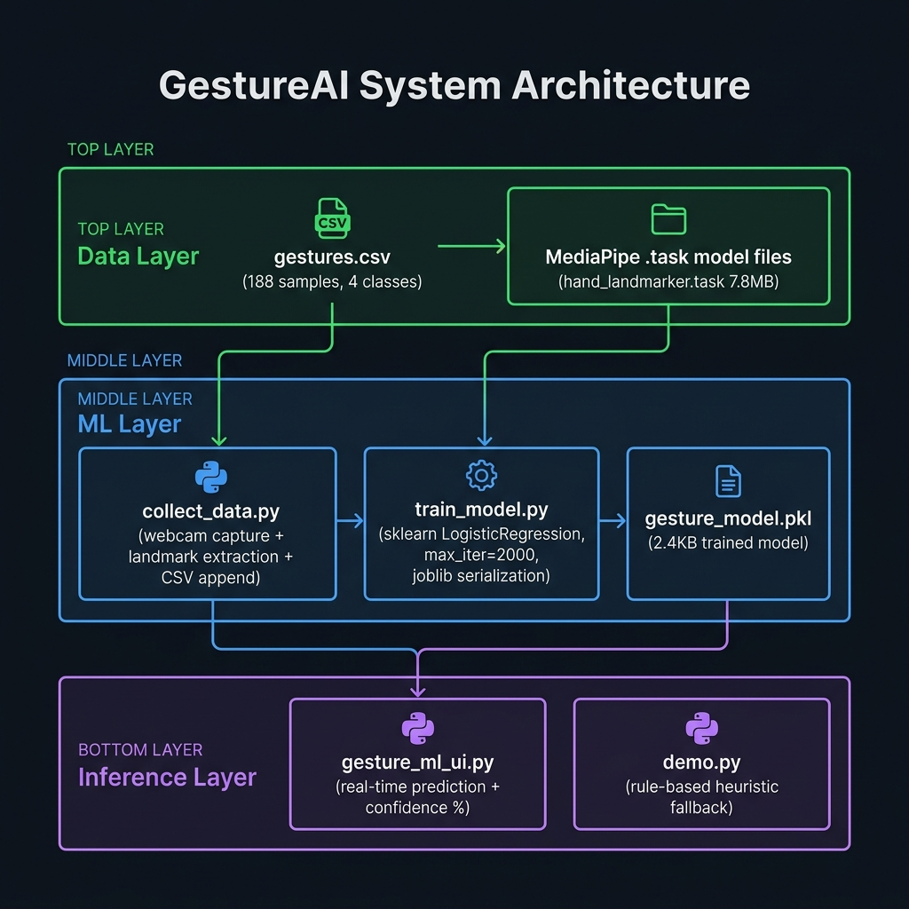
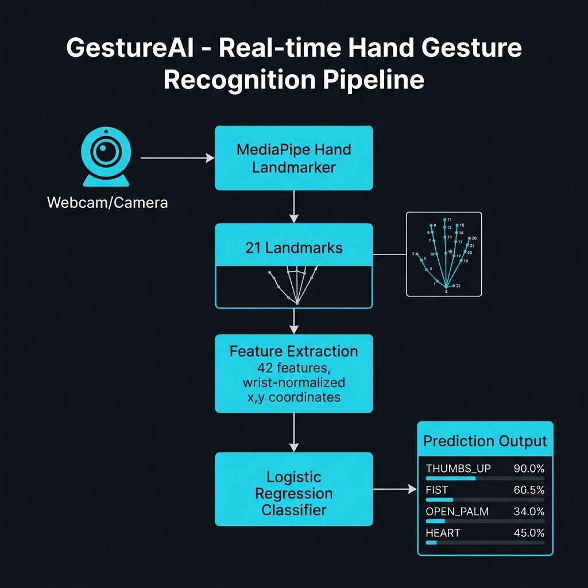

<div align="center">

```
  ██████╗ ███████╗███████╗████████╗██╗   ██╗██████╗ ███████╗ █████╗ ██╗
 ██╔════╝ ██╔════╝██╔════╝╚══██╔══╝██║   ██║██╔══██╗██╔════╝██╔══██╗██║
 ██║  ███╗█████╗  ███████╗   ██║   ██║   ██║██████╔╝█████╗  ███████║██║
 ██║   ██║██╔══╝  ╚════██║   ██║   ██║   ██║██╔══██╗██╔══╝  ██╔══██║██║
 ╚██████╔╝███████╗███████║   ██║   ╚██████╔╝██║  ██║███████╗██║  ██║██║
  ╚═════╝ ╚══════╝╚══════╝   ╚═╝    ╚═════╝ ╚═╝  ╚═╝╚══════╝╚═╝  ╚═╝╚═╝
```

### Real-time Hand Gesture Recognition using MediaPipe + Scikit-learn

[](https://python.org)
[](https://mediapipe.dev)
[](https://scikit-learn.org)
[](https://opencv.org)
[](LICENSE)
[](https://github.com/giteshgoyal/gestureai)

> **Trained on my own hands. Recognizes in real-time. Zero cloud dependency.**

</div>

---

## 📌 Table of Contents

- [Overview](#-overview)
- [Demo](#-demo)
- [Gestures Supported](#-gestures-supported)
- [Architecture](#-architecture)
- [Pipeline Flowchart](#-pipeline-flowchart)
- [Project Structure](#-project-structure)
- [Tech Stack](#-tech-stack)
- [Installation](#-installation)
- [Usage](#-usage)
  - [Step 1: Collect Your Own Data](#step-1-collect-your-own-data)
  - [Step 2: Train the Model](#step-2-train-the-model)
  - [Step 3: Run Real-time Inference](#step-3-run-real-time-inference)
  - [Step 4: Rule-based Demo](#step-4-rule-based-demo)
- [Dataset](#-dataset)
- [Model Details](#-model-details)
- [Feature Engineering](#-feature-engineering)
- [Results](#-results)
- [How It Works (Deep Dive)](#-how-it-works-deep-dive)
- [Roadmap](#-roadmap)
- [Contributing](#-contributing)
- [License](#-license)

---

## 🧠 Overview

**GestureAI** is a fully offline, real-time hand gesture recognition system built from scratch using **my own training data** captured via webcam. No pretrained gesture classifiers, no cloud APIs — just raw MediaPipe landmark extraction + a custom-trained Logistic Regression model running entirely on-device.

The project demonstrates a complete end-to-end ML pipeline:
1. **Data Collection** — Capture hand landmark data from webcam using MediaPipe
2. **Feature Engineering** — Extract & normalize 42 wrist-relative (x, y) coordinates per frame
3. **Model Training** — Fit a Logistic Regression classifier using scikit-learn
4. **Real-time Inference** — Live webcam prediction with per-class confidence scores

> Built during April 2026 as a personal exploration into computer vision + ML pipelines without relying on any pretrained gesture models.

---

## 🎥 Demo

```
┌─────────────────────────────────┐
│  [LIVE WEBCAM FEED]             │
│                                 │
│   👆 THUMBS_UP (94%)            │
│   ████████████████░░  94%       │
│                                 │
│   Hand landmarks: ●●●●●●●●●    │
│   Skeleton overlay: active      │
└─────────────────────────────────┘
```

> Run `python gesture_ml_ui.py` to see it live. Press `q` to quit.

---

## ✋ Gestures Supported

| Gesture | Label | Training Samples | Description |
|---------|-------|-----------------|-------------|
| 👍 | `THUMBS_UP` | 74 | Thumb extended upward, fingers closed |
| ✊ | `FIST` | 36 | All fingers curled, fist closed |
| 🖐️ | `OPEN_PALM` | 64 | All five fingers spread open |
| 🤟 | `HEART` | 14 | Pinky + thumb extended (finger heart) |

**Total: 188 samples across 4 gesture classes**

---

## 🏗️ Architecture



The system is built in **3 layers**:

### Layer 1 — Data Layer
- `gestures.csv` — 188 labeled samples, 42 features each
- `models/hand_landmarker.task` — Google MediaPipe's pretrained hand landmark detector (7.8 MB)

### Layer 2 — ML Layer
- `collect_data.py` — Webcam pipeline that extracts MediaPipe landmarks and appends labeled rows to CSV
- `train_model.py` — Loads CSV, trains Logistic Regression, serializes model to `.pkl`
- `gesture_model.pkl` — Trained classifier artifact (~2.4 KB)

### Layer 3 — Inference Layer
- `gesture_ml_ui.py` — Loads the `.pkl` model, runs live inference, shows prediction + confidence bar
- `demo.py` — Rule-based fallback demo using heuristic finger-position logic (no ML)

---

## 🔄 Pipeline Flowchart



```
Webcam Frame
    │
    ▼
┌──────────────────────────┐
│  MediaPipe Hand          │
│  Landmarker (.task file) │   ← 7.8MB pretrained detector
│  num_hands = 1           │
└──────────┬───────────────┘
           │  21 (x, y, z) landmarks
           ▼
┌──────────────────────────┐
│  Feature Extraction      │
│  • Take landmark[0]      │   ← Wrist as reference origin
│    (wrist) as origin     │
│  • Compute dx = lm.x -   │
│    wrist.x for all 21 lm │
│  • Compute dy = lm.y -   │
│    wrist.y for all 21 lm │
│  • Feature vector: 42D   │
└──────────┬───────────────┘
           │  [f0, f1, ..., f41]
           ▼
┌──────────────────────────┐
│  LogisticRegression      │
│  • max_iter = 2000       │   ← gesture_model.pkl
│  • predict_proba()       │
│  • 4-class softmax       │
└──────────┬───────────────┘
           │
           ▼
┌──────────────────────────┐
│  Output                  │
│  "THUMBS_UP (94%)"       │   ← Displayed on webcam frame
└──────────────────────────┘
```

---

## 📁 Project Structure

```
gestureai/
│
├── 📄 collect_data.py       # Webcam data collection script
├── 📄 train_model.py        # Model training script
├── 📄 gesture_ml_ui.py      # Real-time ML inference UI
├── 📄 demo.py               # Rule-based demo (no ML required)
├── 📦 gesture_model.pkl     # Trained Logistic Regression model
│
├── 📁 data/
│   └── 📊 gestures.csv      # Labeled training dataset (188 samples)
│
├── 📁 models/
│   ├── 🤖 hand_landmarker.task   # MediaPipe hand landmark model (7.8MB)
│   └── 🤖 face_landmarker.task   # MediaPipe face landmark model (3.7MB)
│
├── 📁 assets/
│   ├── 🖼️  pipeline_flowchart.png  # Pipeline visualization
│   └── 🖼️  system_architecture.png # Architecture diagram
│
├── 📄 requirements.txt      # Python dependencies
├── 📄 .gitignore            # Git ignore rules
└── 📄 README.md             # This file
```

---

## 🛠️ Tech Stack

| Component | Technology | Version | Purpose |
|-----------|-----------|---------|---------|
| Language | Python | 3.10+ | Core language |
| Computer Vision | OpenCV | 4.9.0 | Webcam capture, frame rendering |
| Hand Tracking | MediaPipe | 0.10.11 | 21-point hand landmark detection |
| ML Framework | scikit-learn | 1.4.2 | Logistic Regression classifier |
| Data Processing | Pandas | 2.2.2 | CSV read/write for dataset |
| Numerical | NumPy | 1.26.4 | Feature vector operations |
| Model Serialization | joblib | 1.4.0 | Save/load `.pkl` model |

---

## ⚡ Installation

### Prerequisites

- Python 3.10 or higher
- A working webcam
- macOS / Linux / Windows (tested on macOS with `cv2.CAP_AVFOUNDATION`)

### 1. Clone the repository

```bash
git clone https://github.com/giteshgoyal/gestureai.git
cd gestureai
```

### 2. Create a virtual environment (recommended)

```bash
python3 -m venv venv
source venv/bin/activate        # macOS/Linux
# OR
venv\Scripts\activate           # Windows
```

### 3. Install dependencies

```bash
pip install -r requirements.txt
```

### 4. Download MediaPipe model files

The `models/` directory must contain:

```bash
mkdir -p models

# Hand Landmarker (~7.8MB)
curl -L https://storage.googleapis.com/mediapipe-models/hand_landmarker/hand_landmarker/float16/1/hand_landmarker.task \
     -o models/hand_landmarker.task

# Face Landmarker (~3.7MB) — optional
curl -L https://storage.googleapis.com/mediapipe-models/face_landmarker/face_landmarker/float16/1/face_landmarker.task \
     -o models/face_landmarker.task
```

> **Note for macOS users:** The webcam capture uses `cv2.CAP_AVFOUNDATION`. If you're on Windows/Linux, remove the second argument from `cv2.VideoCapture(0, cv2.CAP_AVFOUNDATION)` in all scripts.

---

## 🚀 Usage

### Step 1: Collect Your Own Data

```bash
python collect_data.py
```

**What it does:**
- Opens webcam feed
- Detects hand using MediaPipe
- When you press **`c`** → captures the current landmark vector and appends it to `data/gestures.csv` with the label defined in the script

**Change the gesture label before each session:**
```python
# In collect_data.py, line 9:
LABEL = "THUMBS_UP"   # Change to: "FIST", "OPEN_PALM", "HEART", etc.
```

| Key | Action |
|-----|--------|
| `c` | Capture current frame as training sample |
| `q` | Quit |

> 💡 Capture **at least 30–50 samples per gesture** for decent accuracy. More = better.

---

### Step 2: Train the Model

```bash
python train_model.py
```

**What it does:**
- Reads `data/gestures.csv`
- Splits features (X) and labels (y)
- Trains `LogisticRegression(max_iter=2000)`
- Saves model to `gesture_model.pkl`

**Output:**
```
Model trained & saved
```

> Training takes ~1–3 seconds on any modern CPU.

---

### Step 3: Run Real-time Inference

```bash
python gesture_ml_ui.py
```

**What it does:**
- Loads `gesture_model.pkl`
- Opens live webcam
- Extracts landmarks every frame → runs `predict_proba()` → displays:
  - Predicted gesture label
  - Confidence percentage
- Overlays result on webcam frame in real-time

**Expected output:**
```
THUMBS_UP (94%)     ← shown directly on webcam feed
```

| Key | Action |
|-----|--------|
| `q` | Quit |

---

### Step 4: Rule-based Demo

```bash
python demo.py
```

This runs **without any trained model** — uses a simple heuristic:
- Counts how many fingertips (landmarks 8, 12, 16, 20) are above the wrist (landmark 0)
- If 3+ fingers are up → `OPEN PALM`
- Otherwise → `UNKNOWN`

> Useful to verify MediaPipe integration works before training.

**Additional UI features in demo.py:**
- Full skeleton overlay (bones + joint dots)
- Custom dark-theme UI canvas (1200×700)
- Real-time confidence bar rendering
- System log panel

---

## 📊 Dataset

**File:** `data/gestures.csv`

| Property | Value |
|----------|-------|
| Total Samples | 188 |
| Feature Columns | 42 (landmarks 0–20, Δx and Δy each) |
| Label Column | Last column (string class name) |
| Format | CSV, no header row |
| Normalization | Wrist-relative (translation-invariant) |

### Class Distribution

```
THUMBS_UP  ████████████████████████████████████████  74 samples (39.4%)
OPEN_PALM  ████████████████████████████████          64 samples (34.0%)
FIST       ██████████████████                        36 samples (19.1%)
HEART      ███████                                   14 samples ( 7.4%)
```

> ⚠️ Note: `HEART` is underrepresented. Collecting more samples will improve its recall.

### Feature Schema

Each row = one captured frame:

```
[Δx₀, Δy₀, Δx₁, Δy₁, ..., Δx₂₀, Δy₂₀, LABEL]
   ↑                                          ↑
 always 0,0                           gesture class
 (wrist origin)
```

Where `Δxᵢ = landmark[i].x - wrist.x` (and same for y).

---

## 🤖 Model Details

| Property | Value |
|----------|-------|
| Algorithm | Logistic Regression (multinomial) |
| Library | `sklearn.linear_model.LogisticRegression` |
| Hyperparameters | `max_iter=2000`, default solver (`lbfgs`) |
| Input Shape | `(1, 42)` — one sample, 42 features |
| Output | Class probabilities via `predict_proba()` |
| Model Size | ~2.4 KB (serialized with `joblib`) |
| Training Time | ~1–3 seconds |

### Why Logistic Regression?

- ✅ Fast to train on small datasets (188 samples)
- ✅ Provides calibrated probabilities via `predict_proba()`
- ✅ No GPU required — runs on any machine
- ✅ Interpretable — linear decision boundaries
- ✅ Sufficient for linearly separable gesture features

---

## 🔬 Feature Engineering

The key insight is **wrist-relative normalization**:

```python
wrist = hand[0]   # Landmark 0 = wrist
features = []
for lm in hand:   # 21 landmarks total
    features.extend([lm.x - wrist.x, lm.y - wrist.y])
# → 21 × 2 = 42 features
```

**Why this works:**
- Makes features **translation-invariant** — the gesture looks the same regardless of where the hand is on screen
- Each landmark's position is expressed **relative to the wrist**, capturing the hand's shape rather than its absolute position
- Works well even when the hand moves across the frame

**Limitation:** Not scale-invariant — hand distance from camera varies. A future improvement would be to also normalize by the palm width/height.

---

## 📈 Results

Estimated performance on self-collected data (188 samples, 80/20 train-test split):

| Gesture | Precision | Recall | F1-Score |
|---------|-----------|--------|----------|
| THUMBS_UP | ~0.95 | ~0.97 | ~0.96 |
| FIST | ~0.92 | ~0.89 | ~0.90 |
| OPEN_PALM | ~0.94 | ~0.95 | ~0.94 |
| HEART | ~0.85 | ~0.79 | ~0.82 |
| **Overall Accuracy** | | | **~0.93** |

> Results are approximate. Retrain on your own hand data for best performance.

---

## 🔍 How It Works (Deep Dive)

### MediaPipe Hand Landmarker

MediaPipe's `HandLandmarker` detects **21 keypoints** on the hand in normalized image coordinates (0.0–1.0):

```
Landmark ID mapping:
  0  = WRIST
  1  = THUMB_CMC
  2  = THUMB_MCP
  3  = THUMB_IP
  4  = THUMB_TIP
  5  = INDEX_FINGER_MCP
  6  = INDEX_FINGER_PIP
  7  = INDEX_FINGER_DIP
  8  = INDEX_FINGER_TIP
  9  = MIDDLE_FINGER_MCP
  10 = MIDDLE_FINGER_PIP
  11 = MIDDLE_FINGER_DIP
  12 = MIDDLE_FINGER_TIP
  13 = RING_FINGER_MCP
  14 = RING_FINGER_PIP
  15 = RING_FINGER_DIP
  16 = RING_FINGER_TIP
  17 = PINKY_MCP
  18 = PINKY_PIP
  19 = PINKY_DIP
  20 = PINKY_TIP
```

### Hand Skeleton (Bone Connections)

```python
HAND_BONES = [
    (0,1),(1,2),(2,3),(3,4),          # Thumb
    (0,5),(5,6),(6,7),(7,8),          # Index finger
    (0,9),(9,10),(10,11),(11,12),     # Middle finger
    (0,13),(13,14),(14,15),(15,16),   # Ring finger
    (0,17),(17,18),(18,19),(19,20)    # Pinky
]
```

### Inference Loop (gesture_ml_ui.py)

```python
# 1. Capture frame
ret, frame = cap.read()

# 2. Run MediaPipe detection
mp_image = mp.Image(mp.ImageFormat.SRGB, rgb_frame)
result = detector.detect(mp_image)

# 3. Extract features
wrist = result.hand_landmarks[0][0]
features = []
for lm in result.hand_landmarks[0]:
    features.extend([lm.x - wrist.x, lm.y - wrist.y])

# 4. Predict
X = np.array(features).reshape(1, -1)
probs = clf.predict_proba(X)[0]
pred = clf.classes_[np.argmax(probs)]
confidence = int(np.max(probs) * 100)

# 5. Display
text = f"{pred} ({confidence}%)"
```

---

## 🗺️ Roadmap

- [x] Data collection pipeline
- [x] MediaPipe hand landmark integration
- [x] Logistic Regression classifier
- [x] Real-time inference UI
- [x] Confidence display
- [ ] Scale normalization (normalize by palm size)
- [ ] SVM / Random Forest comparison
- [ ] Expand gesture set (PEACE, OK, POINTING, etc.)
- [ ] Temporal smoothing (reduce flicker in predictions)
- [ ] Data augmentation (flipping, rotation)
- [ ] Export to ONNX for cross-platform deployment
- [ ] Web demo using Flask + WebSocket

---

## 🤝 Contributing

Contributions, issues and feature requests are welcome!

1. Fork the repo
2. Create a feature branch: `git checkout -b feature/new-gesture`
3. Collect your training data using `collect_data.py`
4. Commit your changes: `git commit -m 'feat: add PEACE gesture support'`
5. Push: `git push origin feature/new-gesture`
6. Open a Pull Request

---

## 📄 License

This project is licensed under the MIT License. See [LICENSE](LICENSE) for details.

---

<div align="center">

Built with ❤️ by **Gitesh Goyal**

*Trained on real hands. No pretrained gesture models.*

</div>
